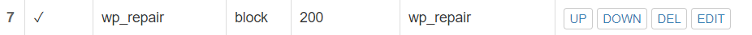
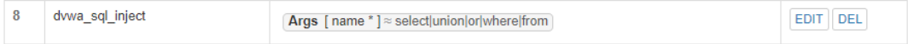

#  WEB服务器

## 实验目的

- 熟悉掌握web服务器

## 实验要求（包括实现）

### 在一台主机（虚拟机）上同时配置Nginx和VeryNginx

* 使用[Wordpress](https://wordpress.org/)搭建的站点对外提供访问的地址为： [http://wp.sec.cuc.edu.cn](http://wp.sec.cuc.edu.cn/)

  访问wordpress`wp.sec.cuc.edu.cn:8888/wordpress`

  

* 使用[Damn Vulnerable Web Application (DVWA)](http://www.dvwa.co.uk/)搭建的站点对外提供访问的地址为： [http://dvwa.sec.cuc.edu.cn](http://dvwa.sec.cuc.edu.cn/)

  访问`dvwa``dvwa.sec.cuc.edu.cn:5566`

  

### 安全加固要求

- 使用IP地址方式均无法访问上述任意站点，并向访客展示自定义的**友好错误提示信息页面-1**

  - 修改 `Matcher`

    

  - 修改 `Response`

    

  - 修改 `Filter`

    

  - 结果

    

- [Damn Vulnerable Web Application (DVWA)](http://www.dvwa.co.uk/)只允许白名单上的访客来源IP，其他来源的IP访问均向访客展示自定义的**友好错误提示信息页面-2**

  * 修改 `Matcher`

    

  * 修改 `Response`

    

  * 修改 `Filter`

    

  * 结果

    

- 在不升级Wordpress版本的情况下，通过定制VeryNginx的访问控制策略规则，热修复[WordPress < 4.7.1 - Username Enumeration](https://www.exploit-db.com/exploits/41497)

  - 修改 `Matcher`

    

  - 修改 `Response`

    

  - 修改 `Filter`

    

  - 结果

    

- 通过配置VeryNginx的Filter规则实现对Damn Vulnerable Web Application (DVWA)的SQL注入实验在低安全等级条件下进行防护

  - 修改 `Matcher`

    

  - 修改 `Response`

    

  - 修改 `Filter`

    

  - 结果

    

### VeryNginx配置要求

- [VeryNginx](https://github.com/alexazhou/VeryNginx)的Web管理页面仅允许白名单上的访客来源IP，其他来源的IP访问均向访客展示自定义的**友好错误提示信息页面-3**

  - 限制DVWA站点的单IP修改 `Matcher`

    

  - 修改 `Response`

    

  - 修改 `Filter`

    

  - 宿主机上还可以正常访问，我们在虚拟机里面配置一下hosts然后去访问发现已经不能访问了，目的达到

    

- 通过定制VeryNginx的访问控制策略规则实现：

  - 限制DVWA站点的单IP访问速率为每秒请求数 < 50

  - 限制Wordpress站点的单IP访问速率为每秒请求数 < 20

  - 超过访问频率限制的请求直接返回自定义**错误提示信息页面-4**

    - 访问速率为每秒请求数 < 50

    - 限制Wordpress站点的单IP访问速率为每秒请求数 < 20

    - 超过访问频率限制的请求直接返回自定义错误提示信息页面-4

      修改 `Response` 

      修改 `Frequency Limit` 

      

  - 禁止curl访问

    - 修改 `Matcher`

      

    - 修改 `Response`

      

    - 修改 `Filter`

      

    - 结果

      ban之前

      

      ban之后

      

## 实验步骤

### 安装Nginx

```
yum install nginx -y
```

- 更改配置文件，将监听端口改为`8888`

  

- 访问`192.168.56.101:8888`

  

### 安装VeryNginx

- 克隆 VeryNginx 仓库到本地, 然后进入仓库目录，执行以下命令

  ```
  $ git clone https://github.com/alexazhou/VeryNginx.git
  $ cd VeryNginx
  ```

- 安装相关依赖

  ```
  # 安装依赖
  $ yum -y install make git gcc pcre-devel pcre openssl openssl-devel
  
  # 安装
  $ sudo python2 install.py install
  ```

- 编辑 VeryNginx 配置文件，设置 监听端口为 `8080`

  

- 开启VeryNginx

  ```
  $ sudo /opt/verynginx/openresty/nginx/sbin/nginx
  ```

- 访问 `192.168.141.129:8080/verynginx/index.html` 到 VeryNginx 的界面，用户/密码为 `verynginx/verynginx`

  

### 修改宿主机上的dns

- 修改 `C:\Windows\System32\drivers\etc\hosts` 文件，添加如下内容

  ```
      192.168.56.101 wp.sec.cuc.edu.cn
      192.168.56.101 dvwa.sec.cuc.edu.cn
      192.168.56.101 verynginx.sec.cuc.edu.cn
  ```


### 安装 wordpress

- 下载mysql、php和相关扩展

  ```
  # 安装数据库
  $ yum install mysql-server
  # 检查是否正常运行，默认下无密码
  $ sudo mysql -u root -p
  
  #安装php和相关扩展
  $ yum install php-fpm php-mysql
  $ yum install php-curl php-gd php-intl php-mbstring php-soap php-xml php-xmlrpc php-zip
  $ sudo systemctl restart php7.2-fpm
  ```

- 新建数据库

  ```
  # mysql新建数据库
  $ sudo mysql -u root -p
  > CREATE DATABASE wordpress DEFAULT CHARACTER SET utf8 COLLATE utf8_unicode_ci;
  > GRANT ALL ON wordpress.* TO 'wpuser'@'localhost' IDENTIFIED BY 'test';
  > FLUSH PRIVILEGES;
  > EXIT;
  ```

- 下载 wordpress

  ```
  $ cd /tmp
  
  # 下载实验指定版本安装包
  $ sudo wget https://github.com/WordPress/WordPress/archive/4.7.zip
  
  # 解压
  $ unzip 4.7.zip
  
  # 移动文件夹
  $ sudo cp /tmp/WordPress-4.7/wp-config-sample.php /tmp/WordPress-4.7/wp-config.php
  $ sudo cp -a /tmp/wordpress/. /var/www/wordpress
  
  # 修改文件夹属主为 www-data
  $ sudo chown -R www-data:www-data /var/www/wordpress
  ```

- 修改 wordpress 相关配置文件

  ```
  $ curl -s https://api.wordpress.org/secret-key/1.1/salt/
  $ sudo vim /var/www/wordpress/wp-config.php
  
          # 修改内容如下
          # 修改相关参数
          define('DB_NAME', 'wordpress');
  
          /** MySQL database username */
          define('DB_USER', 'wpuser');
  
          /** MySQL database password */
          define('DB_PASSWORD', 'test');
  
          # 新增相关内容
          define('FS_METHOD', 'direct');
  
  $ sudo vim /etc/nginx/conf.d/default.conf
  
          # 增加内容
          location ~ \.php$ {
              include fastcgi_params;
              fastcgi_pass unix:/var/run/php/php7.2-fpm.sock;
              }
          
          # 修改网站根站点
          root /var/www/html/wordpress;
          # 修改监听端口
          listen 8888;
          # 修改server_name
          wp.sec.cuc.edu.cn
  ```

  

  ​    

  ```
  # 检查配置文件
  $ sudo nginx -t
  
  # 重启nginx
  $ sudo systemctl restart nginx
  ```

### 安装 dvwa

- 下载安装包

  ```
  $ cd /tmp
  $ git clone https://github.com/ethicalhack3r/DVWA
  $ sudo cp /tmp/DVWA /var/www/html
  ```

- 新建数据库

  ```
  $ sudo mysql -u root -p
  
  > CREATE DATABASE dvwa DEFAULT CHARACTER SET utf8mb4 COLLATE utf8mb4_unicode_ci;
  > GRANT ALL ON dvwa.* TO 'dvwauser'@'localhost' IDENTIFIED BY 'test';
  > FLUSH PRIVILEGES;
  > EXIT;
  
  $ sudo systemctl restart mysql
  ```

- 修改dvwa数据库相关和其他设置

  ```
  $ cd /var/www/html/DVWA
  $ cp config/config.inc.php.dist config/config.inc.php
  $ sudo vim /var/www/html/DVWA/config/config.inc.php 
          
          # 修改以下内容
          $_DVWA[ 'db_database' ] = 'dvwa';
          $_DVWA[ 'db_user' ]     = 'dvwauser';
          $_DVWA[ 'db_password' ] = 'test';
  
  # 修改文件属主
  $ sudo chown -R www-data:www-data /var/www/html/DVWA
  
  # 修改 nginx 相关配置
  $ sudo vim /etc/nginx/conf.d/default.conf
  
          server {
                  listen 5566;
                  server_name  dvwa.sec.cuc.edu.cn;
  
                  root /var/www/html/DVWA;
                  index index.html index.htm index.php index.nginx-debian.html;
  
                  location / {
                          try_files $uri $uri/ = 404;
                          }
  
                  location ~ \.php$ {
                          include snippets/fastcgi-php.conf;
                          fastcgi_pass unix:/var/run/php/php7.2-fpm.sock;
                          }
                          }
  
  # 修改php相关设置
  $ sudo vim  /etc/php/7.2/fpm/php.ini
  
          # 修改以下内容
          allow_url_include = On
          display_errors = off
  
  # 重启php，使配置生效
  $ sudo systemctl restart php7.2-fpm
  
  $ 重启nginx，使配置生效
  $ sudo systemctl restart nginx
  ```

  

  

### 设置 VeryNginx 为代理

- 修改配置文件，将原本wordpressd的 `8888` 端口修改为 `127.0.0.1:8888`，DVWA的 `5566` 端口修改为 `127.0.0.1:5566`

- 通过 `VeryNginx` 进行相关设置

  

  

  

- 为了能以https的方式访问 `wordpress`，在 `VeryNginx` 中设置443端口，并配证书

  ```
  # 生成证书
  $ sudo openssl req -x509 -nodes -days 365 -newkey rsa:2048 -keyout /etc/ssl/wordpress-selfsigned.key -out /etc/ssl/certs/wordpress-selfsigned.crt
  
  # 将证书地址写入文件，方便后面使用
  $ sudo vim /etc/nginx/self-signed.conf
          ssl_certificate /etc/ssl/certs/wordpress-selfsigned.crt;
          ssl_certificate_key /etc/ssl/private/wordpress-selfsigned.key;
  
  # 修改 VeryNginx 设置
  $ sudo vim /opt/verynginx/openresty/nginx/conf/nginx.conf
  
          # 增加以下内容
          server {
                  listen 443 ssl;
                  server_name wp.sec.cuc.edu.cn;
                  root /var/www/html;
                  include /opt/verynginx/verynginx/nginx_conf/in_server_block.conf;
                  include /etc/nginx/snippets/self-sign.conf;
  
                  location = / {
                          root html;
                          index index.html index.html;
                  }
          }
  
  # 修改 nginx 设置
  $ sudo vim /etc/nginx/sites-available/default
  
          # 在 wordpress 对应的 server 中增加如下
  
          include /etc/nginx/snippets/self-sign.conf;
  ```
