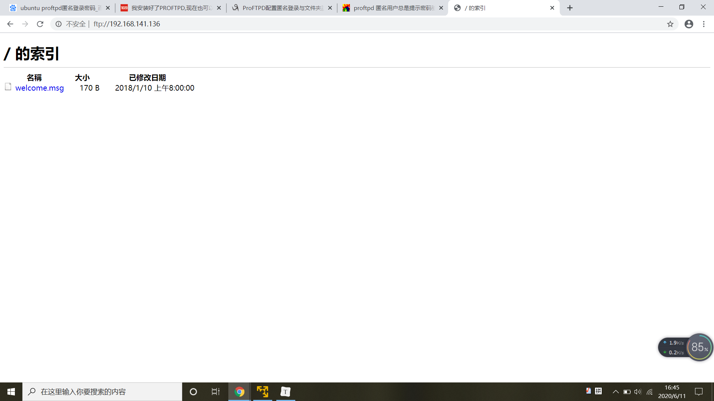
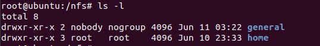
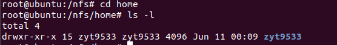
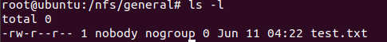
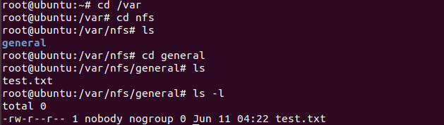
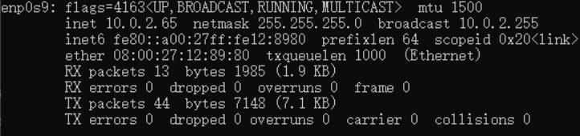
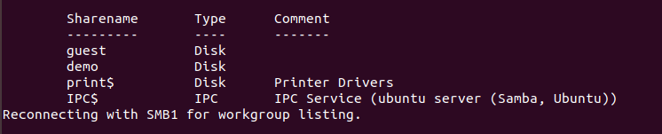
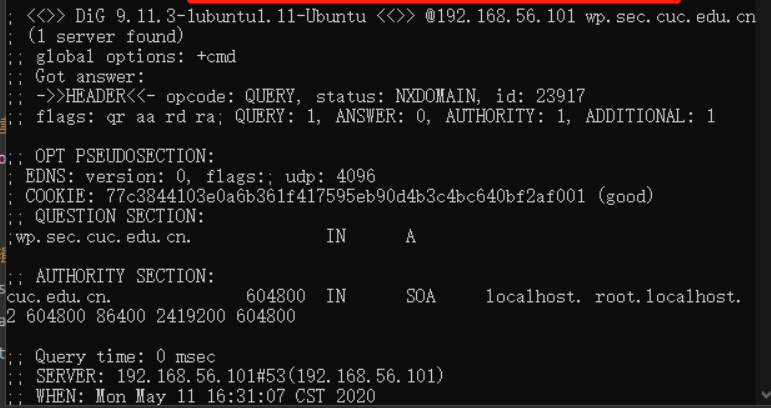

# shell脚本编程练习进阶

## 实验目的

- 进一步熟悉shell脚本编程

## 实验要求

### 软件环境建议

* FTP
  * 对照第6章课件中的要求选择一款合适的FTP服务器软件支持所有任务要求

- NFS
  - 对照第6章课件中的NFS服务器配置任务
- DHCP
  - 2台虚拟机使用Internal网络模式连接，其中一台虚拟机上配置DHCP服务，另一台服务器作为DHCP客户端，从该DHCP服务器获取网络地址配置
- Samba
  - 对照第6章课件中smbclient一节的3点任务要求完成Samba服务器配置和客户端配置连接测试

* DNS
  * 基于上述Internal网络模式连接的虚拟机实验环境，在DHCP服务器上配置DNS服务，使得另一台作为DNS客户端的主机可以通过该DNS服务器进行DNS查询
  * 在DNS服务器上添加 `zone "cuc.edu.cn"` 的以下解析记录

```
ns.cuc.edu.cn NS
ns A <自行填写DNS服务器的IP地址>
wp.sec.cuc.edu.cn A <自行填写第5章实验中配置的WEB服务器的IP地址>
dvwa.sec.cuc.edu.cn CNAME wp.sec.cuc.edu.cn
```

### shell脚本编程基本要求

* 目标测试与验证系统为本学期课程指定操作系统版本
* 自动安装与自动配置过程的启动脚本要求在本地执行

- ***提示***：配置远程目标主机的SSH免密root登录，安装脚本、配置文件可以从工作主机（执行启动脚本所在的主机）上通过scp或rsync方式拷贝或同步到远程目标主机，然后再借助SSH的***远程命令执行***功能实现远程控制安装和配置

- 假设目标系统没有配置过root用户免密登录，所以我们要求在自动安装脚本中包含自动配置远程root用户免密登录的代码
- 脚本在执行过程中，如果需要在目标主机上创建目录、创建临时文件、执行网络下载等操作需要判断执行是否成功，并进行必要的异常处理（例如：apt-get update失败，则退出脚本执行，并将友好错误信息打印在控制台上。临时目录不存在，则自动创建该临时目录）

- 所有服务的配置文件、临时目录需设置正确的目录和文件归属和权限位，禁止使用***777***这种偷懒的权限位设置
- 减少不必要的安装过程中的人机交互输入，尽可能全部通过脚本的方式完成选项设置和交互式问题输入等
- 目标环境相关参数应使用独立的配置文件或配置脚本（在主调脚本中引用配置脚本）

- 目标服务器IP
- 目标服务器SSH服务的端口
- 目标服务器上使用的用户名
- 目标服务器上用于临时存储安装脚本、配置文件的临时目录路径

## 实验步骤

### FTP

- 选择的FTP服务器软件：`proftpd`

- 安装vsftpd

  ```
  sudo apt-get install proftpd
  ```

- [匿名访问者可以访问1个目录且仅拥有该目录及其所有子目录的只读访问权限；]

  * 修改配置文件`/etc/proftpd/proftpd.conf`

  ```
  # 将配置文件中的匿名模块的注释去掉
  <Anonymous ~ftp>
     User				ftp
     Group				nogroup
     # We want clients to be able to login with "anonymous" as well as "ftp"
     UserAlias			anonymous ftp
     # Cosmetic changes, all files belongs to ftp user
     DirFakeUser	on ftp
     DirFakeGroup on ftp
   
     RequireValidShell		off
   
     # Limit the maximum number of anonymous logins
     MaxClients			10
   
     # We want 'welcome.msg' displayed at login, and '.message' displayed
     # in each newly chdired directory.
     DisplayLogin			welcome.msg
     DisplayChdir		.message
   
     # Limit WRITE everywhere in the anonymous chroot
     <Directory *>
       <Limit WRITE>
         DenyAll
       </Limit>
     </Directory>
   
     # Uncomment this if you're brave.
     # <Directory incoming>
     #   # Umask 022 is a good standard umask to prevent new files and dirs
     #   # (second parm) from being group and world writable.
     #   Umask				022  022
     #            <Limit READ WRITE>
     #            DenyAll
     #            </Limit>
     #            <Limit STOR>
     #            AllowAll
     #            </Limit>
     # </Directory>
   
   </Anonymous>
  
  ```

  * 通过chrome登录ftp服务器

  

- [配置一个支持用户名和密码方式访问的账号，该账号继承匿名访问者所有权限，且拥有对另1个独立目录及其子目录完整读写（包括创建目录、修改文件、删除文件等）权限；]

  * 修改配置文件

  ```
  AuthOrder			mod_auth_pam.c* mod_auth_unix.c
  #同时支持匿名用户和帐号密码方式登录
  AuthUserFile /etc/proftpd/ftpd.passwd
  AuthUserFile /etc/proftpd/ftpd.group
  ```

  * 添加用户

  ```
  cat /etc/passwd |grep www-data  #查看UID值
  
  sudo ftpasswd --passwd --file=/etc/proftpd/ftpd.passwd --name=ftp_another --uid=33 --home=/home/ftp_other --shell=/sbin/nologin
  
  sudo ftpasswd --group --file=/etc/proftpd/ftpd.group --name=ftp_group --gid=33
  
  sudo ftpasswd --group --name=ftp_group --gid=33 --member=ftp_another
  ```

  - FTP用户不能越权访问指定目录之外的任意其他目录和文件

    ```
    DefaultRoot                     #撤销注释
    ```

  - 匿名访问权限仅限白名单IP来源用户访问，禁止白名单IP以外的访问；

    ```
    #Anonymous模块内加入
    <Limit LOGIN /home/ftp/*>
    Order allow,deny
    Allow from 192.168.26.101
    Deny from all
    </Limit>
    ```

### NFS

- [在1台Linux上配置NFS服务，另1台电脑上配置NFS客户端挂载2个权限不同的共享目录，分别对应只读访问和读写访问权限；]

- 安装服务器端

  ```
  sudo apt install nfs-kernel-server
  # nfs-kernel-server 服务名 
  ```

- 安装客户端

  ```
    sudo apt install nfs-common
  ```

- 创建可读写的目录

  ```
  #创建一个用于挂载的可读写的文件夹
  mkdir /var/nfs/general -p
  chown nobody:nogroup /var/nfs/general
  ```

- 只读目录 `/home` （无需创建）

- 配置文件 /etc/exports 指定clients ip和权限

  ```
  /var/nfs/general    192.168.141.136(rw,sync,no_subtree_check)
  /home      192.168.141.136(sync,no_root_squash,no_subtree_check)
  ```

- 在Client上创建相应的挂载文件

  ```
  sudo mkdir -p /nfs/general
  sudo mkdir -p /nfs/home
  ```

- 在Client上挂载文件夹

  ```
  sudo /etc/init.d/nfs-kernel-server restart  #重启nfs
  sudo mount 192.168.141.136:/var/nfs/general /nfs/general
  sudo mount 192.168.141.136:/home /nfs/home
  ```

- NFS中的文件属主、权限查看

  - NFS客户端文件夹的属主、权限信息

    

  - NFS只读文件夹的属主、权限信息

    

  - NFS读写文件夹的属主、权限信息

    

  - 通过nfs客户端创建的文件属主、权限信息

    

  - 上述共享目录中文件、子目录的属主、权限信息和在NFS服务器端上查看到的信息一样吗？无论是否一致，请给出你查到的资料是如何讲解NFS目录中的属主和属主组信息应该如何正确解读

    一样。资料显示：在/etc/exports配合文件中设置共享文件夹属性时，会涉及到一个参数no_root_squash，如果不设置这个参数，即使在客户端使用sudo创建目录文件，属主和权限信息都继承父文件夹，并不是root:root；相反，如果设置该参数，以sudo创建的目录文件就会是root:root。

### DHCP

- 2台虚拟机使用Internal网络模式连接，其中一台虚拟机上配置DHCP服务，另一台服务器作为DHCP客户端，从该DHCP服务器获取网络地址配置

- server端：进行DHCP服务器的安装和配置

  * 修改server  /etc/network/interfaces配置文件

    ```
    auto enp0s9
    iface enp0s9 inet static
    address 192.168.254.25
    netmask 255.255.255.0
    gateway 192.168.254.25
    ```

  * server端安装软件

    ```
    apt install isc-dhcp-server
    ```

  * 修改server中/etc/default/isc-dhcp-server文件  配置提供DHCP服务的网卡

    ```
    INTERFACES="enp0s9"
    ```

  * 修改server中/etc/dhcp/dhcpd.conf文件  添加如下配置如下

    ```
    subnet 10.0.2.0 netmask 255.255.255.0 {
    range dynamic-bootp 10.0.2.65 10.0.2.100;
    option broadcast-address 10.0.2.255;
    option subnet-mask 255.255.255.0;
    default-lease-time 600;
    max-lease-time 7200;
    }
    ```

  * server端开启 isc-dhcp-server 服务

    ```
    service isc-dhcp-server restart
    ```

- client端：

  * 修改 /etc/netplan/01-netcfg.yaml

    ```
    enp0s9:
    dhcp4: yes
    ```

- 最终客户端ip显示

  

### Samba

- Samba配置独立共享服务器：Linux设置匿名访问共享目录、Linux设置用户名密码方式的共享目录

- 安装samba

  ```
  sudo apt install samba
  ```

- 修改配置文件 etc/samba/smb.conf

  ```
  #添加以下内容
  [guest]
          # This share allows anonymous (guest) access
          # without authentication!
          path = /srv/samba/guest/
          read only = yes
          guest ok = yes
  
  [demo]
          # This share requires authentication to access
          path = /srv/samba/demo/
          read only = no
          guest ok = no
          force create mode = 0660
          force directory mode = 2770
          force user = demoUser
          force group = demoGroup
  ```

- Linux设置匿名访问共享目录/Linux设置用户名密码方式的共享目录

  * 安装

    ```
    sudo apt install samba
    ```

  * 创建用户

    ```
    useradd -M -s /sbin/nologin ${SMB_USER}
    sudo passwd smbuser
    ```

  * 在linux中添加同名用户

    ```
    smbpasswd -a smbuser
    ```

  * 使设置的账户生效

    ```
    smbpasswd -e smbuser
    ```

  * 创建用户组并加入

    ```
    groupadd smbgroup
    usermod -G smbgroup smbuser
    ```

  * 创建用于共享的文件夹并修改用户组

    ```
    sudo mkdir -p /home/samba/guest/
    sudo mkdir -p /home/samba/demo/
    sudo chgrp -R smbgroup /home/samba/guest/
    sudo chgrp -R smbgroup /home/samba/demo/
    sudo chmod 2775 /home/samba/guest/
    sudo chmod 2770 /home/samba/demo/
    ```

  * 启动Samba

    ```
    smbd
    ```

  * 客户端为win10访问共享文件夹
    \\192.168.141.136\guest
    \\192.168.141.136\demo

  

- 在windows指定目录设置为共享用户名密码方式共享目录

  * 在linux下载安装smbclient
  
    ```
    sudo apt-get install smbclient
    ```
  
* 查看所有共享目录（需要输入windows的用户名和密码 -u指定windows的登陆用户名 然后需要输入密码）
  
    ```
    smbclient -L 192.168.141.136 -U Administer
    ```
  
  

### DNS

- 基于上述Internal网络模式连接的虚拟机实验环境，在DHCP服务器上配置DNS服务，使得另一台作为DNS客户端的主机可以通过该DNS服务器进行DNS查询

- 创建并配置bind9

  * 安装bind9

    ```
    apt-get install bind9
    ```

  * 打开 /etc/bind/named.conf.local 添加以下内容
    zone "cuc.edu.cn" {
        type master;
        file "/etc/bind/db.cuc.edu.cn"
    };  

  * 创建保存域名解析的db文件
    sudo cp /etc/bind/db.local /etc/bind/db.cuc.edu.cn

  * 编辑/etc/bind/db.cuc.edu.cn文件 添加需要解析的域名
    wp.sec.cuc.edu.cn       IN      A       10.0.2.15
    dvwa.sec.cuc.edu.cn     IN      CNAME   wp.sec.cuc.edu.cn.
    test.com                IN      A       10.0.2.65

  * 重启服务
    service bind9 restart

- 结果如下

  ```
  dig @192.168.141.136 wp.sec.cuc.edu.cn
  ```

  
